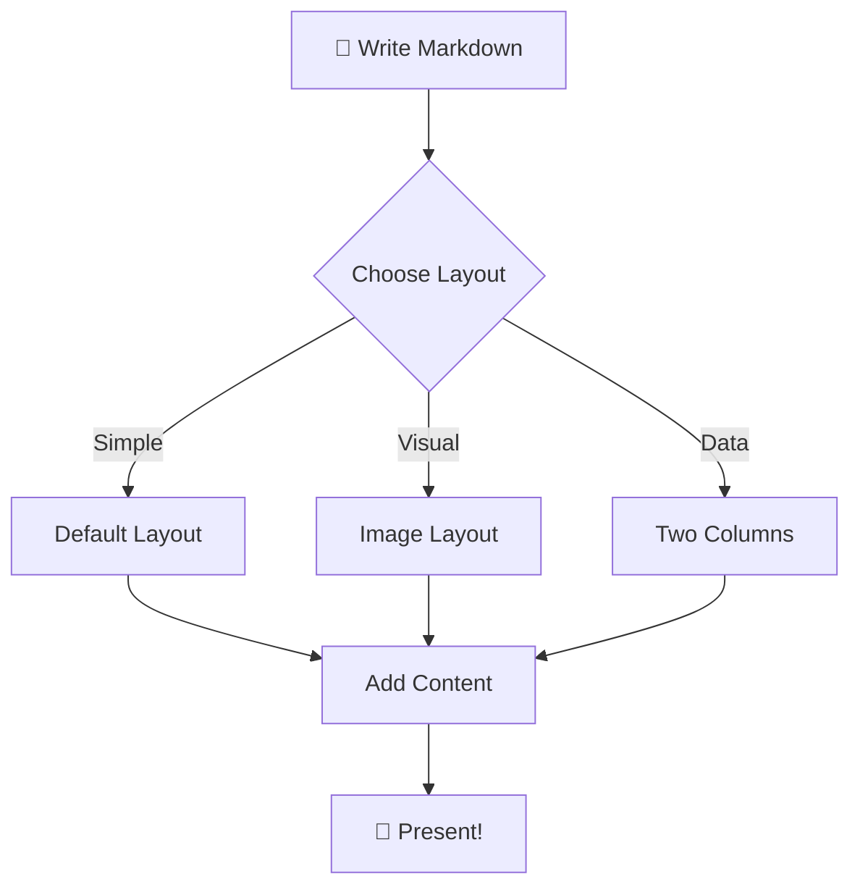
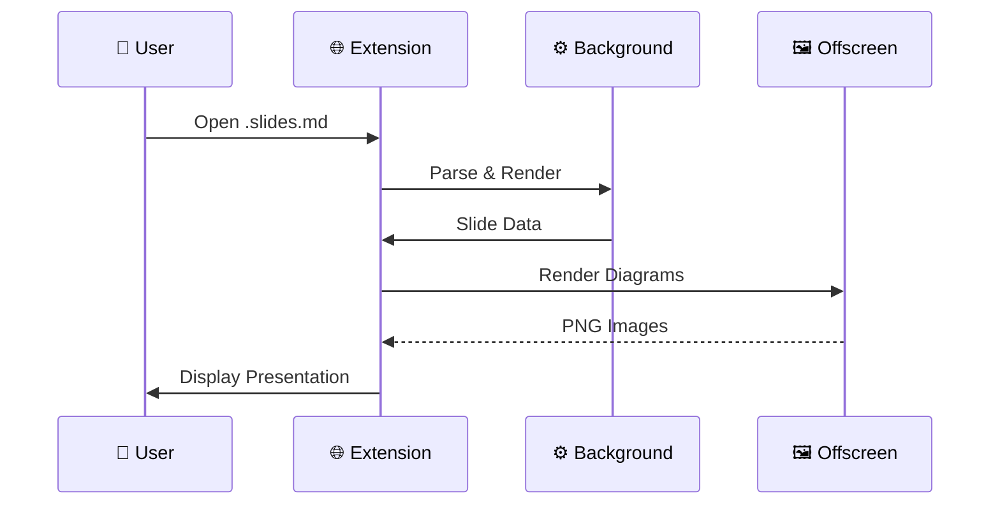
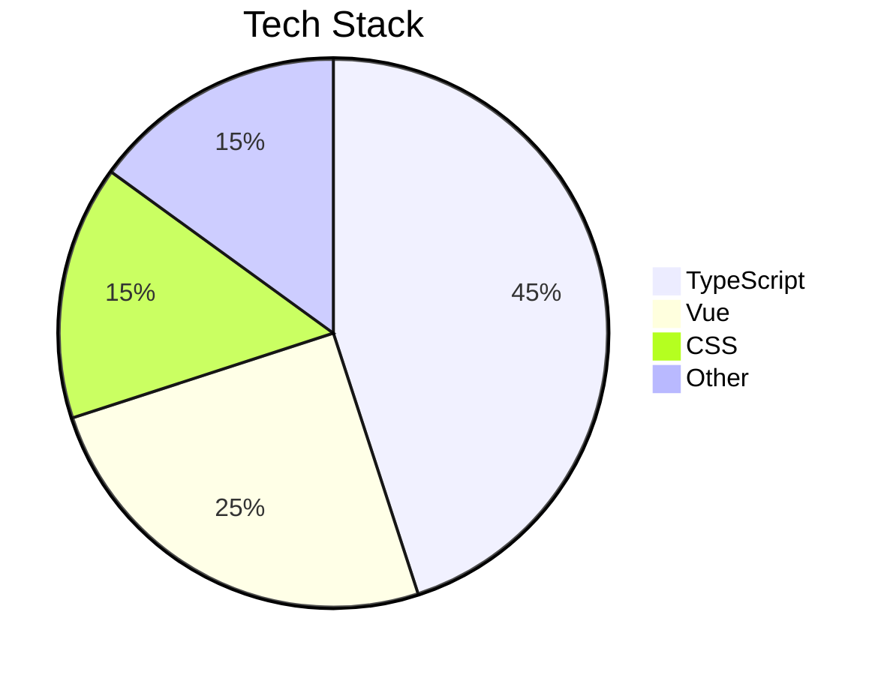
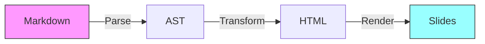

# Slidev Feature Showcase

A comprehensive demo of layouts, animations, code, diagrams, and more.

<v-clicks>

- 📝 Markdown-powered slides
- 🎨 Themeable & customizable
- 🧑‍💻 Developer-first experience
- ✨ Animations & transitions

</v-clicks>

<!--
This is the cover slide with presenter notes.
The first slide defaults to "cover" layout automatically.
v-clicks makes each bullet appear one by one.
-->

---

# Markdown Essentials

Slidev supports **bold**, *italic*, ~~strikethrough~~, `inline code`, and [links](https://sli.dev).

> "Any sufficiently advanced technology is indistinguishable from magic." — Arthur C. Clarke

### Unordered List

- First item with **emphasis**
- Second item with `code`
- Third item with *italics*

### Ordered List

1. Plan your slides
2. Write in Markdown
3. Present with style

---

# Tables & Emoji

| Feature | Syntax | Status |
|---------|--------|--------|
| Bold | `**text**` | ✅ |
| Code Block | ` ``` ` | ✅ |
| Tables | `\| col \|` | ✅ |
| LaTeX Math | `$E=mc^2$` | ✅ |
| Diagrams | ` ```mermaid ` | ✅ |
| v-clicks | `<v-clicks>` | ✅ |

### Emoji Support 🎉

Slidev renders emoji natively: 🚀 📊 💡 🔥 ⚡ 🎯 📝 ✨

---
layout: section
---

# Layout System

Slidev provides 18+ built-in layouts for different content needs

---
layout: two-cols
---

# Two Columns

The `two-cols` layout splits content into left and right panels using the `::right::` slot separator.

- Great for comparisons
- Side-by-side content
- Code vs output

::right::

```typescript
interface Layout {
  name: string;
  slots: string[];
}

const twoCol: Layout = {
  name: 'two-cols',
  slots: ['default', 'right']
};
```

---
layout: two-cols-header
---

# Two Columns with Header

::left::

### 📋 Left Panel

This layout has a **shared header** spanning the full width, then splits into two columns below.

- `::left::` slot
- `::right::` slot

::right::

### 📋 Right Panel

Perfect for:

1. Feature comparisons
2. Before/After views
3. Pros vs Cons
4. Input vs Output

---
layout: center
---

# Center Layout

This content is **centered** both horizontally and vertically.

Perfect for impactful single statements or key takeaways.

`layout: center`

---
layout: fact
---

# 100%
Markdown-powered

---
layout: statement
---

# Developer Experience Matters
Every feature in Slidev is designed with developers in mind

---
layout: section
---

# Code Highlighting

Powered by Shiki with dual-theme support (light & dark)

---

# TypeScript

```typescript
interface User {
  id: number;
  name: string;
  email: string;
  roles: ('admin' | 'editor' | 'viewer')[];
}

async function fetchUser(id: number): Promise<User> {
  const response = await fetch(`/api/users/${id}`);
  if (!response.ok) {
    throw new Error(`HTTP ${response.status}`);
  }
  return response.json();
}

const user = await fetchUser(42);
console.log(`Welcome, ${user.name}!`);
```

---
layout: two-cols
---

# Multi-Language

Code highlighting across **11 languages**.

```python
# Python
def fibonacci(n: int) -> list[int]:
    fib = [0, 1]
    for i in range(2, n):
        fib.append(fib[-1] + fib[-2])
    return fib

print(fibonacci(10))
```

::right::

<div class="mt-10"></div>

```sql
-- SQL
SELECT u.name, COUNT(o.id) AS orders
FROM users u
LEFT JOIN orders o
  ON u.id = o.user_id
WHERE u.created_at > '2025-01-01'
GROUP BY u.name
HAVING COUNT(o.id) > 5
ORDER BY orders DESC;
```

---

# More Languages

```bash
#!/bin/bash
# Bash script
for file in *.md; do
  echo "Processing: $file"
  wc -l "$file"
done
```

```yaml
# YAML configuration
server:
  host: 0.0.0.0
  port: 3000
  cors:
    origins: ['https://example.com']
    methods: [GET, POST, PUT]
```

```json
{
  "name": "slidev-demo",
  "version": "1.0.0",
  "scripts": {
    "dev": "slidev",
    "build": "slidev build"
  }
}
```

---
layout: section
---

# Diagrams

Mermaid, PlantUML, and Graphviz — rendered as images

---

# Mermaid: Flowchart



---

# Mermaid: Sequence Diagram



---
layout: two-cols
---

# More Mermaid Charts



::right::



---
layout: section
---

# Mathematics

LaTeX equations rendered with KaTeX

---

# Math Formulas

### Inline Math

The quadratic formula $x = \frac{-b \pm \sqrt{b^2 - 4ac}}{2a}$ solves any quadratic equation $ax^2 + bx + c = 0$.

### Block Equations

$$
\int_{-\infty}^{\infty} e^{-x^2} \, dx = \sqrt{\pi}
$$

### Matrix

$$
\mathbf{A} = \begin{pmatrix}
1 & 2 & 3 \\
4 & 5 & 6 \\
7 & 8 & 9
\end{pmatrix}
$$

### Maxwell's Equations

$$
\begin{aligned}
\nabla \cdot \vec{E} &= \frac{\rho}{\varepsilon_0} \\
\nabla \cdot \vec{B} &= 0 \\
\nabla \times \vec{E} &= -\frac{\partial \vec{B}}{\partial t} \\
\nabla \times \vec{B} &= \mu_0 \vec{J} + \mu_0 \varepsilon_0 \frac{\partial \vec{E}}{\partial t}
\end{aligned}
$$

---
layout: section
---

# Animations

Click-based reveals with `<v-clicks>` and `<v-click>`

---

# v-clicks: List Animation

Each item appears on click:

<v-clicks>

- 🔍 **Step 1** — Identify the problem
- 📐 **Step 2** — Design the solution
- 💻 **Step 3** — Write the code
- 🧪 **Step 4** — Test thoroughly
- 🚀 **Step 5** — Ship it!

</v-clicks>

---

# v-click: Element Animation

<v-click>

### 🎯 First: Define your goal

Every great presentation starts with a clear objective.

</v-click>

<v-click>

### 📊 Then: Support with data

| Metric | Before | After |
|--------|--------|-------|
| Load Time | 3.2s | 0.8s |
| Bundle Size | 450KB | 120KB |
| Lighthouse | 67 | 98 |

</v-click>

<v-click>

### ✅ Finally: Call to action

Try Slidev today → `npm init slidev`

</v-click>

---
layout: two-cols
---

# Animations in Columns

<v-clicks>

- ✏️ Write content in Markdown
- 🧩 Pick a layout
- 🎨 Apply a theme
- ⚡ Add animations

</v-clicks>

::right::

<v-clicks>

- 📈 Embed diagrams
- 🔢 Include math formulas
- 💻 Show code examples
- 🎯 Present like a pro

</v-clicks>

---
layout: quote
---

# "Simplicity is the ultimate sophistication."

— Leonardo da Vinci

<!--
The quote layout centers text with a distinctive quotation style.
Great for impactful quotes between content sections.
-->

---

# Scoped Styles & UnoCSS

<div class="text-center mb-6">

Each slide can have its own **scoped CSS** that won't leak to other slides.

</div>

<div class="grid grid-cols-3 gap-4">
<div class="p-4 bg-blue-100 rounded-lg text-center">

### 💙 Blue Card
UnoCSS utility classes

</div>
<div class="p-4 bg-green-100 rounded-lg text-center">

### 💚 Green Card
`bg-green-100 rounded-lg`

</div>
<div class="p-4 bg-purple-100 rounded-lg text-center">

### 💜 Purple Card
Grid layout with `gap-4`

</div>
</div>

<style>
h3 {
  font-size: 1.1rem;
  margin-bottom: 0.5rem;
}
</style>

---
layout: intro
---

# Summary

### What we covered today:

- 📝 **Markdown** — Rich text, tables, emoji, links
- 📐 **Layouts** — cover, center, two-cols, section, fact, quote, intro
- 💻 **Code** — 11 languages with Shiki dual-theme highlighting
- 📊 **Diagrams** — Mermaid flowcharts, sequences, pie charts
- 🔢 **Math** — LaTeX inline and block equations with KaTeX
- ✨ **Animations** — v-clicks, v-click, step-by-step reveals
- 🎨 **Styling** — Scoped CSS, UnoCSS utilities, themes

---
layout: end
---

# Thank You!

Powered by **Slidev** + **Markdown Viewer Extension**
