# PlantUML 图表完整演示

[toc]

本文档展示 PlantUML 图表的各类用法。支持 `plantuml` 和 `puml` 两种 code block 语言标识，以及 `.plantuml` 和 `.puml` 文件扩展名。

---

## 1. 类图

### 1.1 基础类图

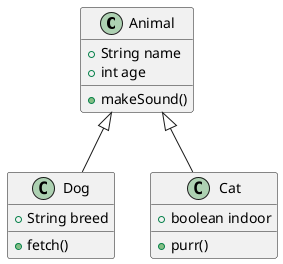

### 1.2 接口与抽象类

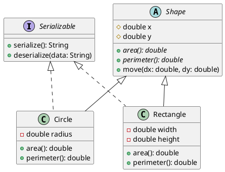

### 1.3 关联关系

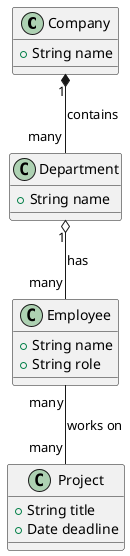

### 1.4 枚举与泛型

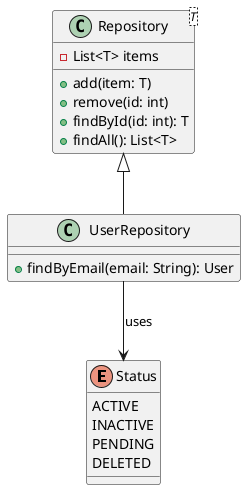

---

## 2. 序列图

### 2.1 基础序列图

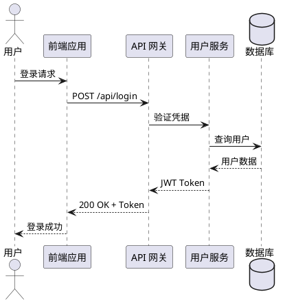

### 2.2 带片段的序列图

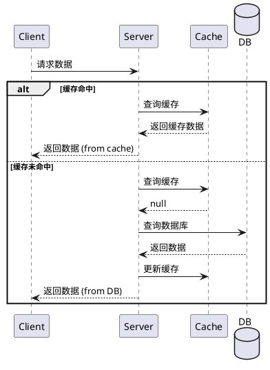

### 2.3 循环与激活

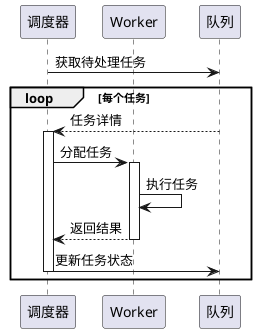

---

## 3. 活动图

### 3.1 基础活动图

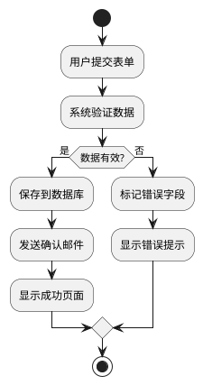

### 3.2 并行处理 (Fork/Join)

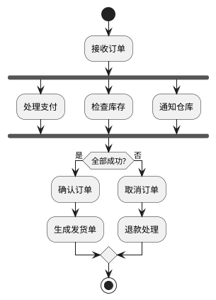

### 3.3 泳道活动图

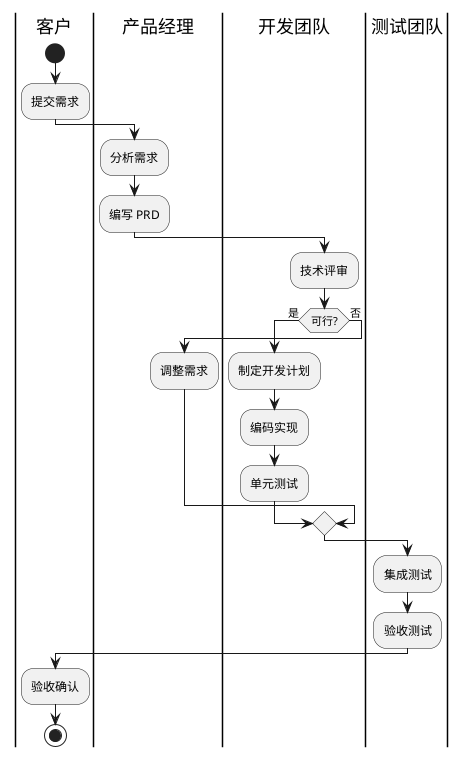

---

## 4. 状态图

### 4.1 基础状态图

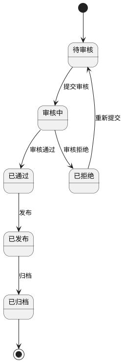

### 4.2 嵌套状态

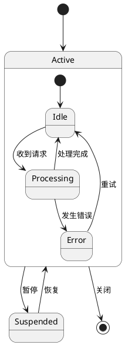

---

## 5. 用例图

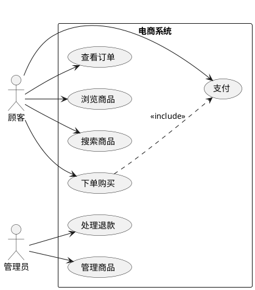

---

## 6. 部署图

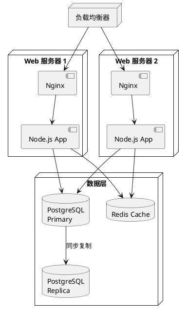

---

## 7. 对象图

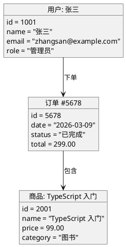

---

## 8. 样式与主题

### 8.1 自定义颜色

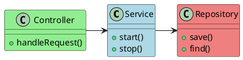

### 8.2 注释

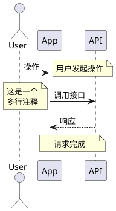

---

## 9. puml 语言标识

使用 `puml` 作为 code block 语言标识同样有效：

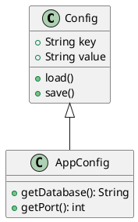
