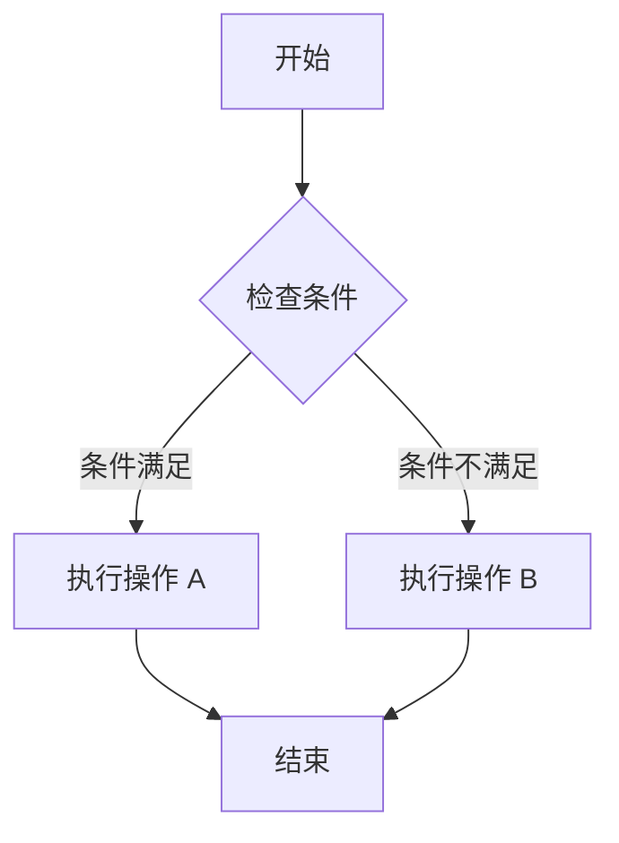
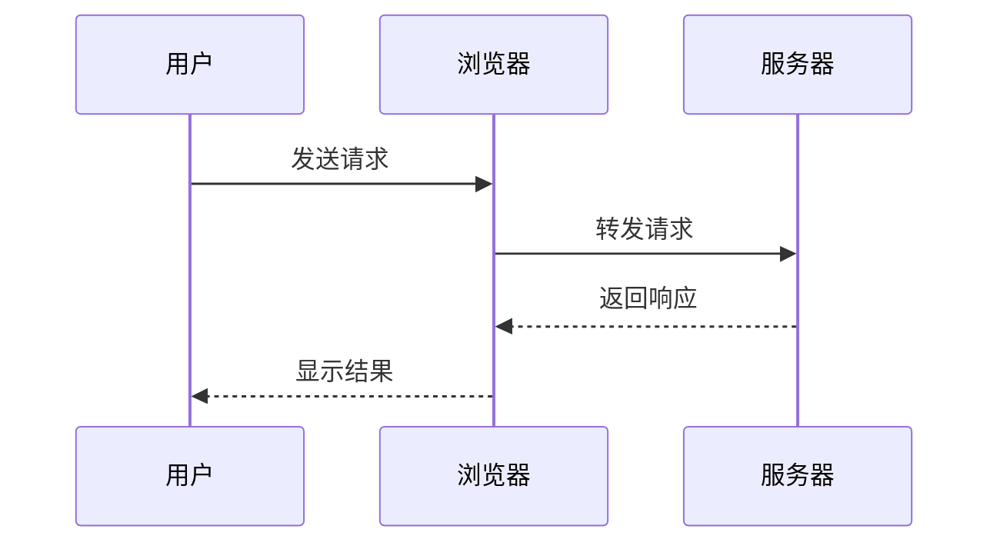
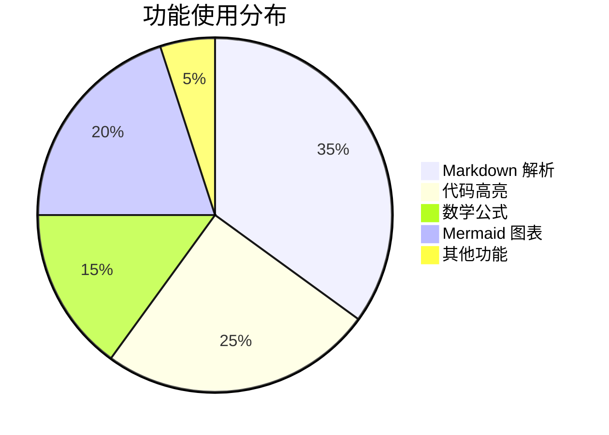
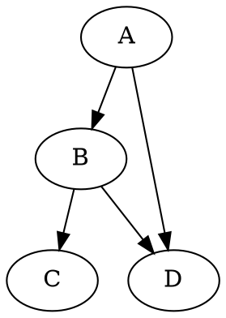
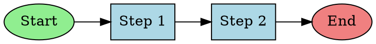
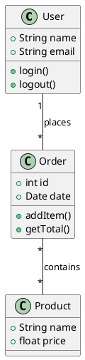
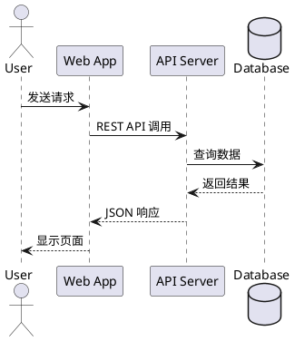
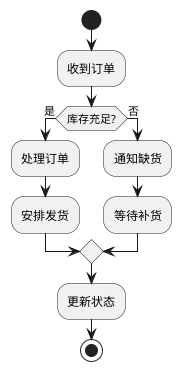

# Markdown Viewer Extension 渲染效果测试

[toc]

本文档用于测试 Chrome 扩展的 Markdown 渲染功能。各类图表的完整演示请参阅独立文档。

[](https://www.apache.org/licenses/LICENSE-2.0)
[](https://www.python.org/)
[](https://reactjs.org/)
[](https://fastapi.tiangolo.com/)
[](https://discord.gg/)

## 测试内容概览

1. **基础语法** - 标题、段落、文本格式
2. **链接和引用** - 超链接、图片、引用块
3. **列表** - 有序列表、无序列表、嵌套列表
4. **表格** - 基础表格、对齐表格
5. **代码** - 行内代码、代码块、多语言语法高亮
6. **数学公式** - KaTeX 行内和块级公式
7. **Mermaid 图表** - [完整演示](./mermaid-demo.md)
8. **Vega-Lite 图表** - [完整演示](./vega-demo.md)
9. **DOT 图表** - [完整演示](./dot-demo.md)
10. **Infographic 图表** - [完整演示](./infographic-demo.md)
11. **Canvas 画布** - [完整演示](./canvas-demo.md)
12. **PlantUML 图表** - [完整演示](./plantuml-demo.md)
13. **drawio 画布** - drawio XML 原生图表
14. **HTML 混合** - [完整演示](./html-demo.md)
15. **Emoji 短代码** - [完整演示](./emoji-demo.md)
16. **边界测试** - 错误处理、极端情况
17. **Inline HTML 详测** - [完整演示](./inline-html-test.md)

---

## 1. 基础 Markdown 语法

### 1.1 标题层级测试

# 一级标题
## 二级标题
### 三级标题
#### 四级标题
##### 五级标题
###### 六级标题

### 1.2 段落和换行

这是第一个段落。段落之间使用空行分隔。

这是第二个段落。测试 remark-breaks 插件的换行功能：
第一行文本
第二行文本（单个换行符应该生效）
第三行文本

### 1.3 文本格式化

**粗体文本** 使用两个星号或下划线包围

*斜体文本* 使用一个星号或下划线包围

***粗斜体*** 使用三个星号

~~删除线~~ 使用两个波浪号

`行内代码` 使用反引号包围

混合格式测试：**粗体中包含 *斜体* 文字**，~~删除线中包含 **粗体**~~

### 1.4 上标和下标

**上标语法** 使用 `^text^` 包围：
- 数学表达：x^2^ + y^2^ = z^2^
- 化学式：Ca^2+^, Fe^3+^

**下标语法** 使用 `~text~` 包围：
- 化学式：H~2~O, CO~2~, H~2~SO~4~
- 数学下标：a~1~, a~2~, ..., a~n~

### 1.5 特殊字符和转义

**Emoji 直接输入：** 😀 🎉 🚀 ✅ ❌ 🔥 💡 📝 ⭐ 🌟

**Emoji 短代码：** :smile: :tada: :rocket: :white_check_mark: :x: :fire: :bulb: :memo: :star: :star2:

**更多短代码：** :heart: :+1: :-1: :ok_hand: :clap: :wave: :thinking: :100: :sparkles: :zap:

**动物短代码：** :cat: :dog: :bear: :panda_face: :monkey: :pig: :frog: :penguin: :whale:

**国旗短代码：** :cn: :us: :jp: :gb: :fr: :de: :kr: :ru:

**Unicode 符号：**
- 数学：∑ ∏ ∫ ∞ ± × ÷ √ ∆ ∇ ∂ ∈ ∉ ⊂ ⊃ ∪ ∩
- 箭头：← → ↑ ↓ ↔ ⇐ ⇒ ⇑ ⇓ ⇔

### 1.6 分割线

---

## 2. 链接和引用

### 2.1 超链接

**外部链接：** [GitHub](https://github.com)

**相对路径链接：** [README 文件](../README.md)

**锚点链接：** [跳转到边界测试](#13-边界测试)

**自动链接：** https://github.com

### 2.2 图片

**网络图片：**


**本地图片（相对路径）：**


**Base64 Data URI 图片：**
 

### 2.3 引用块

> 这是一个简单的引用块。
> 
> 引用块可以包含多个段落。

> **嵌套引用测试：**
> 
> 外层引用内容
> 
> > 这是嵌套的引用
> > 
> > 可以包含 **格式化** 文本和 `代码`

### 2.4 引用块内嵌套列表

**引用块内的无序列表：**
> 这是引用块内的列表：
> - 列表项 1
> - 列表项 2
> - 列表项 3

**引用块内的有序列表：**
> 步骤说明：
> 1. 第一步
> 2. 第二步
> 3. 第三步

**多层嵌套（引用 + 引用 + 列表）：**
> 外层引用
> > 内层引用
> > - 内层列表项 1
> > - 内层列表项 2

### 2.5 引用块中嵌套代码块

**单层引用中的代码块：**
> 这是一个引用块，里面包含代码：
> 
> ```javascript
> function example() {
>   console.log("代码在引用块中");
> }
> ```
> 
> 引用块中代码块后面的文字。

**多层嵌套引用中的代码块：**
> 第1层引用
> 
> > 第2层引用
> > 
> > > 第3层引用，包含代码：
> > > 
> > > ```javascript
> > > function deepNested() {
> > >   console.log("3层嵌套");
> > > }
> > > ```
> > > 
> > > 第3层后续文字。
> > 
> > 第2层后续文字。
> 
> 第1层后续文字。

---

## 3. 列表

### 3.1 无序列表

- 列表项 1
- 列表项 2
- 列表项 3

### 3.2 有序列表

1. 第一项
2. 第二项
3. 第三项

### 3.3 嵌套列表

1. 第一层 (1. 2. 3.)
2. 第一层第二项
   1. 第二层 (i. ii. iii.)
   2. 第二层第二项
      1. 第三层 (a. b. c.)
      2. 第三层第二项

### 3.4 任务列表

- [x] 已完成的任务
- [ ] 未完成的任务
- [x] 另一个已完成的任务

### 3.5 列表中嵌套子块

**列表中嵌套引用块：**
- 第一项普通文本
- 第二项包含引用块：
  > 这是嵌套在列表项中的引用块
  > 引用块的第二行
- 第三项普通文本

**列表中嵌套代码块：**
- 列表项一
- 列表项二，包含代码块：
  ```javascript
  function hello() {
    console.log("Hello World");
  }
  ```
- 列表项三

**多层嵌套列表中的子块：**
1. 第一层列表项
   - 第二层列表项
     - 第三层列表项，包含引用：
       > 深层嵌套的引用块
       > 应该保持正确的缩进
   - 第二层另一项
2. 第一层另一项

**列表中引用块中嵌套代码块：**
- 列表项一
- 列表项二，包含引用和代码：
  > 这是列表项中的引用块，里面有代码：
  > 
  > ```python
  > def nested_example():
  >     print("列表 > 引用 > 代码")
  > ```
  > 
  > 引用块后续文字。
- 列表项三

---

## 4. 表格

### 4.1 基础表格

| 列1 | 列2 | 列3 |
|-----|-----|-----|
| 单元格 A1 | 单元格 B1 | 单元格 C1 |
| 单元格 A2 | 单元格 B2 | 单元格 C2 |

### 4.2 对齐表格

| 左对齐 | 居中对齐 | 右对齐 |
|:-------|:--------:|-------:|
| Left | Center | Right |
| 文本 | 123 | 456 |

### 4.3 功能状态表

| 功能 | 状态 | 描述 |
|------|:----:|------|
| Markdown 解析 | ✅ | 完整支持 GFM |
| 代码语法高亮 | ✅ | highlight.js |
| 数学公式渲染 | ✅ | KaTeX 引擎 |
| Mermaid 图表 | ✅ | 转 PNG 输出 |

### 4.4 空单元格自动合并

启用"自动合并空表格单元格"选项后，空单元格会与上方单元格合并（rowspan）。

| 分类 | 项目 | 说明 |
|------|------|------|
| 水果 | 苹果 | 红色 |
|      | 香蕉 | 黄色 |
|      | 葡萄 | 紫色 |
| 蔬菜 | 番茄 | 红色 |
|      | 黄瓜 | 绿色 |
| 饮料 | 咖啡 | 提神 |

上表中，"分类"列的空单元格会自动与上方合并：
- "水果" 跨 3 行
- "蔬菜" 跨 2 行
- "饮料" 单独 1 行

**边缘情形：首行空单元格**

如果第一行的单元格本身就是空的，则不会与任何单元格合并（没有上方可合并）。连续的空行会保持独立：

| 分组 | 名称 | 备注 |
|------|------|------|
|      | 项目A | 无分组 |
|      | 项目B | 无分组 |
| 已分组 | 项目C | 有分组 |
|      | 项目D | 继承 |

上表中：
- 第1、2行的"分组"列是空的，但因为是首行，不会合并，各自独立显示
- 第3、4行的"已分组" 跨 2 行（正常合并）

---

## 5. 代码

### 5.1 行内代码

在文本中使用 `console.log()` 或 `print()` 等函数。

### 5.2 代码块

**JavaScript：**
```javascript
// ES6+ Features
async function fetchUserData(userId) {
    try {
        const response = await fetch(`/api/users/${userId}`);
        const userData = await response.json();
        return { success: true, data: userData };
    } catch (error) {
        console.error('Error fetching user data:', error);
        throw new Error(`Failed to fetch user ${userId}`);
    }
}
```

**Python：**
```python
from typing import List, Dict, Optional
import asyncio

class DataProcessor:
    def __init__(self, config: Dict[str, str]):
        self.config = config
        self.results: List[str] = []
    
    async def process_items(self, items: List[str]) -> Optional[Dict]:
        """Process items and return results"""
        processed = []
        for item in items:
            if item.strip():
                result = await self._process_single_item(item)
                processed.append(result)
        return {"total": len(processed), "items": processed}
```

**SQL：**
```sql
SELECT u.id, u.username, COUNT(p.id) as post_count
FROM users u
LEFT JOIN posts p ON u.id = p.user_id
WHERE u.created_at >= '2024-01-01'
GROUP BY u.id, u.username
ORDER BY post_count DESC
LIMIT 20;
```

---

## 6. 数学公式 (KaTeX)

### 6.1 行内公式

这是行内公式：$E = mc^2$，爱因斯坦质能方程。

常见数学表达式：$\alpha + \beta = \gamma$，$x^2 + y^2 = r^2$

### 6.2 块级公式

**二次方程求根公式：**
$$
x = \frac{-b \pm \sqrt{b^2 - 4ac}}{2a}
$$

**矩阵表示：**
$$
\begin{bmatrix}
a & b \\
c & d
\end{bmatrix}
\begin{bmatrix}
x \\
y
\end{bmatrix}
=
\begin{bmatrix}
ax + by \\
cx + dy
\end{bmatrix}
$$

**欧拉公式：**
$$
e^{ix} = \cos x + i\sin x
$$

---

## 7. Mermaid 图表

> 📖 完整演示请查看 [Mermaid 图表完整演示](./mermaid-demo.md)

### 7.1 流程图



### 7.2 序列图



### 7.3 饼图



---

## 8. Vega-Lite 图表

> 📖 完整演示请查看 [Vega-Lite 图表完整演示](./vega-demo.md)

### 8.1 柱状图

```vega-lite
{
  "$schema": "https://vega.github.io/schema/vega-lite/v5.json",
  "description": "A simple bar chart.",
  "data": {
    "values": [
      {"category": "A", "value": 28},
      {"category": "B", "value": 55},
      {"category": "C", "value": 43},
      {"category": "D", "value": 91}
    ]
  },
  "mark": "bar",
  "encoding": {
    "x": {"field": "category", "type": "nominal"},
    "y": {"field": "value", "type": "quantitative"}
  }
}
```

### 8.2 折线图

```vega-lite
{
  "$schema": "https://vega.github.io/schema/vega-lite/v5.json",
  "description": "A simple line chart.",
  "data": {
    "values": [
      {"month": "Jan", "sales": 100},
      {"month": "Feb", "sales": 150},
      {"month": "Mar", "sales": 120},
      {"month": "Apr", "sales": 180}
    ]
  },
  "mark": {"type": "line", "point": true},
  "encoding": {
    "x": {"field": "month", "type": "ordinal"},
    "y": {"field": "sales", "type": "quantitative"}
  }
}
```

---

## 9. DOT 图表 (Graphviz)

> 📖 完整演示请查看 [DOT 图表完整演示](./dot-demo.md)

### 9.1 简单有向图



### 9.2 带样式的有向图



---

## 10. HTML 混合内容

> 📖 完整演示请查看 [HTML 混合内容完整演示](./html-demo.md)

### 10.1 提示框

<div style="padding: 15px; background: #f0f9ff; border-left: 4px solid #0284c7; margin: 10px 0;">
  <strong>💡 提示：</strong>这是一个使用 HTML 编写的提示框。
</div>

### 10.2 状态卡片

<div style="display: flex; gap: 10px; margin: 20px 0;">
  <div style="flex: 1; padding: 15px; background: #dcfce7; border-radius: 8px;">
    <h4 style="margin: 0 0 8px 0; color: #166534;">✅ 成功</h4>
    <p style="margin: 0; font-size: 14px;">操作已成功完成</p>
  </div>
  <div style="flex: 1; padding: 15px; background: #fee2e2; border-radius: 8px;">
    <h4 style="margin: 0 0 8px 0; color: #991b1b;">❌ 错误</h4>
    <p style="margin: 0; font-size: 14px;">发生了一个错误</p>
  </div>
</div>

### 10.3 Inline HTML 详测

> 📖 完整演示请查看 [Inline HTML 全面测试](./inline-html-test.md)

- 无效标签应显示为文本：<M> <X> <myTag>
- 上下标：x<sup>2</sup> + H<sub>2</sub>O
- 常见样式标签（移除标签保留内容）：<mark>highlight</mark> <small>small</small>
- 键盘按键：Press <kbd>Ctrl</kbd>+<kbd>C</kbd>

### 10.4 本地图片

<div>
  
</div>

### 10.5 远程图片

<div>
  
</div>

---

## 11. Infographic 图表

> 📖 完整演示请查看 [Infographic 图表完整演示](./infographic-demo.md)

### 11.1 流程箭头

```infographic
infographic list-row-simple-horizontal-arrow
data
  title 简单流程
  items
    - label 开始
      desc 启动项目
    - label 执行
      desc 实施方案
    - label 完成
      desc 收尾总结
```

### 11.2 金字塔图

```infographic
infographic sequence-pyramid-simple
data
  title 数字化转型层级
  items
    - label 战略创新
      desc 数据驱动决策
    - label 分析平台
      desc 企业洞察
    - label 数据整合
      desc 统一数据源
    - label 基础设施
      desc 云和系统基础
```

### 11.3 漏斗图

```infographic
infographic sequence-filter-mesh-simple
data
  title 销售漏斗
  desc 客户转化分析
  items
    - label 访客
      desc 10000 网站访问
    - label 线索
      desc 2500 注册用户
    - label 机会
      desc 500 意向客户
    - label 成交
      desc 125 付费客户
```

### 11.4 思维导图

```infographic
infographic hierarchy-mindmap-branch-gradient-compact-card
data
  title 项目结构
  items
    - label 项目管理
      children
        - label 计划
          children
            - label 需求分析
            - label 资源规划
        - label 执行
          children
            - label 开发
            - label 测试
        - label 监控
          children
            - label 进度跟踪
            - label 质量控制
```

---

## 12. Canvas 画布

> 📖 完整演示请查看 [Canvas 画布完整演示](./canvas-demo.md)

### 12.1 简单流程

```canvas
{
  "nodes": [
    {"id": "a", "type": "text", "text": "需求", "x": 0, "y": 0, "width": 80, "height": 50, "color": "5"},
    {"id": "b", "type": "text", "text": "开发", "x": 120, "y": 0, "width": 80, "height": 50, "color": "4"},
    {"id": "c", "type": "text", "text": "测试", "x": 240, "y": 0, "width": 80, "height": 50, "color": "3"},
    {"id": "d", "type": "text", "text": "发布", "x": 360, "y": 0, "width": 80, "height": 50, "color": "6"}
  ],
  "edges": [
    {"id": "e1", "fromNode": "a", "fromSide": "right", "toNode": "b", "toSide": "left"},
    {"id": "e2", "fromNode": "b", "fromSide": "right", "toNode": "c", "toSide": "left"},
    {"id": "e3", "fromNode": "c", "fromSide": "right", "toNode": "d", "toSide": "left"}
  ]
}
```

### 12.2 带分组的画布

```canvas
{
  "nodes": [
    {"id": "g1", "type": "group", "label": "前端", "x": -10, "y": -10, "width": 220, "height": 80, "color": "4"},
    {"id": "n1", "type": "text", "text": "React", "x": 0, "y": 10, "width": 80, "height": 40, "color": "4"},
    {"id": "n2", "type": "text", "text": "Vue", "x": 100, "y": 10, "width": 80, "height": 40, "color": "4"},
    {"id": "g2", "type": "group", "label": "后端", "x": -10, "y": 100, "width": 220, "height": 80, "color": "6"},
    {"id": "n3", "type": "text", "text": "Node.js", "x": 0, "y": 120, "width": 80, "height": 40, "color": "6"},
    {"id": "n4", "type": "text", "text": "Python", "x": 100, "y": 120, "width": 80, "height": 40, "color": "6"}
  ],
  "edges": [
    {"id": "e1", "fromNode": "n1", "fromSide": "bottom", "toNode": "n3", "toSide": "top"},
    {"id": "e2", "fromNode": "n2", "fromSide": "bottom", "toNode": "n4", "toSide": "top"}
  ]
}
```

---

## 13. PlantUML 图表

> 📖 完整演示请查看 [PlantUML 图表完整演示](./plantuml-demo.md)

### 13.1 类图



### 13.2 序列图



### 13.3 活动图



---

## 14. drawio 画布

# 网络架构图

```drawio
<?xml version="1.0" encoding="UTF-8"?>
<mxfile>
  <diagram name="AWS Network Architecture" id="aws-network-arch">
    <mxGraphModel dx="1200" dy="800" grid="1" gridSize="10">
      <root>
        <mxCell id="0"/>
        <mxCell id="1" parent="0"/>
        
        <!-- AWS Cloud Group -->
        <mxCell id="aws-cloud" value="AWS Cloud" style="points=[[0,0],[0.25,0],[0.5,0],[0.75,0],[1,0],[1,0.25],[1,0.5],[1,0.75],[1,1],[0.75,1],[0.5,1],[0.25,1],[0,1],[0,0.75],[0,0.5],[0,0.25]];outlineConnect=0;gradientColor=none;html=1;whiteSpace=wrap;fontSize=12;fontStyle=0;container=1;pointerEvents=0;collapsible=0;recursiveResize=0;shape=mxgraph.aws4.group;grIcon=mxgraph.aws4.group_aws_cloud_alt;strokeColor=#232F3E;fillColor=none;verticalAlign=top;align=left;spacingLeft=30;fontColor=#232F3E;dashed=0;" vertex="1" parent="1">
          <mxGeometry x="40" y="40" width="820" height="540" as="geometry"/>
        </mxCell>
        
        <!-- VPC -->
        <mxCell id="vpc" value="VPC 10.0.0.0/16" style="points=[[0,0],[0.25,0],[0.5,0],[0.75,0],[1,0],[1,0.25],[1,0.5],[1,0.75],[1,1],[0.75,1],[0.5,1],[0.25,1],[0,1],[0,0.75],[0,0.5],[0,0.25]];outlineConnect=0;gradientColor=none;html=1;whiteSpace=wrap;fontSize=12;fontStyle=0;container=1;pointerEvents=0;collapsible=0;recursiveResize=0;shape=mxgraph.aws4.group;grIcon=mxgraph.aws4.group_vpc2;strokeColor=#8C4FFF;fillColor=none;verticalAlign=top;align=left;spacingLeft=30;fontColor=#AAB7B8;dashed=0;" vertex="1" parent="aws-cloud">
          <mxGeometry x="40" y="60" width="740" height="440" as="geometry"/>
        </mxCell>
        
        <!-- Availability Zone 1 -->
        <mxCell id="az1" value="Availability Zone 1" style="fillColor=none;strokeColor=#147EBA;dashed=1;verticalAlign=top;fontStyle=0;fontColor=#147EBA;whiteSpace=wrap;html=1;" vertex="1" parent="vpc">
          <mxGeometry x="30" y="50" width="320" height="360" as="geometry"/>
        </mxCell>
        
        <!-- Availability Zone 2 -->
        <mxCell id="az2" value="Availability Zone 2" style="fillColor=none;strokeColor=#147EBA;dashed=1;verticalAlign=top;fontStyle=0;fontColor=#147EBA;whiteSpace=wrap;html=1;" vertex="1" parent="vpc">
          <mxGeometry x="390" y="50" width="320" height="360" as="geometry"/>
        </mxCell>
        
        <!-- Public Subnet 1 -->
        <mxCell id="public-subnet-1" value="Public subnet 10.0.1.0/24" style="points=[[0,0],[0.25,0],[0.5,0],[0.75,0],[1,0],[1,0.25],[1,0.5],[1,0.75],[1,1],[0.75,1],[0.5,1],[0.25,1],[0,1],[0,0.75],[0,0.5],[0,0.25]];outlineConnect=0;gradientColor=none;html=1;whiteSpace=wrap;fontSize=10;fontStyle=0;container=1;pointerEvents=0;collapsible=0;recursiveResize=0;shape=mxgraph.aws4.group;grIcon=mxgraph.aws4.group_security_group;grStroke=0;strokeColor=#7AA116;fillColor=#F2F6E8;verticalAlign=top;align=left;spacingLeft=30;fontColor=#248814;dashed=0;" vertex="1" parent="vpc">
          <mxGeometry x="50" y="90" width="280" height="130" as="geometry"/>
        </mxCell>
        
        <!-- Public Subnet 2 -->
        <mxCell id="public-subnet-2" value="Public subnet 10.0.2.0/24" style="points=[[0,0],[0.25,0],[0.5,0],[0.75,0],[1,0],[1,0.25],[1,0.5],[1,0.75],[1,1],[0.75,1],[0.5,1],[0.25,1],[0,1],[0,0.75],[0,0.5],[0,0.25]];outlineConnect=0;gradientColor=none;html=1;whiteSpace=wrap;fontSize=10;fontStyle=0;container=1;pointerEvents=0;collapsible=0;recursiveResize=0;shape=mxgraph.aws4.group;grIcon=mxgraph.aws4.group_security_group;grStroke=0;strokeColor=#7AA116;fillColor=#F2F6E8;verticalAlign=top;align=left;spacingLeft=30;fontColor=#248814;dashed=0;" vertex="1" parent="vpc">
          <mxGeometry x="410" y="90" width="280" height="130" as="geometry"/>
        </mxCell>
        
        <!-- Private Subnet 1 -->
        <mxCell id="private-subnet-1" value="Private subnet 10.0.3.0/24" style="points=[[0,0],[0.25,0],[0.5,0],[0.75,0],[1,0],[1,0.25],[1,0.5],[1,0.75],[1,1],[0.75,1],[0.5,1],[0.25,1],[0,1],[0,0.75],[0,0.5],[0,0.25]];outlineConnect=0;gradientColor=none;html=1;whiteSpace=wrap;fontSize=10;fontStyle=0;container=1;pointerEvents=0;collapsible=0;recursiveResize=0;shape=mxgraph.aws4.group;grIcon=mxgraph.aws4.group_security_group;grStroke=0;strokeColor=#00A4A6;fillColor=#E6F6F7;verticalAlign=top;align=left;spacingLeft=30;fontColor=#147EBA;dashed=0;" vertex="1" parent="vpc">
          <mxGeometry x="50" y="250" width="280" height="140" as="geometry"/>
        </mxCell>
        
        <!-- Private Subnet 2 -->
        <mxCell id="private-subnet-2" value="Private subnet 10.0.4.0/24" style="points=[[0,0],[0.25,0],[0.5,0],[0.75,0],[1,0],[1,0.25],[1,0.5],[1,0.75],[1,1],[0.75,1],[0.5,1],[0.25,1],[0,1],[0,0.75],[0,0.5],[0,0.25]];outlineConnect=0;gradientColor=none;html=1;whiteSpace=wrap;fontSize=10;fontStyle=0;container=1;pointerEvents=0;collapsible=0;recursiveResize=0;shape=mxgraph.aws4.group;grIcon=mxgraph.aws4.group_security_group;grStroke=0;strokeColor=#00A4A6;fillColor=#E6F6F7;verticalAlign=top;align=left;spacingLeft=30;fontColor=#147EBA;dashed=0;" vertex="1" parent="vpc">
          <mxGeometry x="410" y="250" width="280" height="140" as="geometry"/>
        </mxCell>
        
        <!-- Internet Gateway -->
        <mxCell id="igw" value="Internet Gateway" style="sketch=0;outlineConnect=0;fontColor=#232F3E;gradientColor=none;fillColor=#8C4FFF;strokeColor=none;dashed=0;verticalLabelPosition=bottom;verticalAlign=top;align=center;html=1;fontSize=10;fontStyle=0;aspect=fixed;pointerEvents=1;shape=mxgraph.aws4.internet_gateway;" vertex="1" parent="1">
          <mxGeometry x="420" y="55" width="50" height="50" as="geometry"/>
        </mxCell>
        
        <!-- NAT Gateway 1 -->
        <mxCell id="nat-gw-1" value="NAT Gateway" style="sketch=0;outlineConnect=0;fontColor=#232F3E;gradientColor=none;fillColor=#8C4FFF;strokeColor=none;dashed=0;verticalLabelPosition=bottom;verticalAlign=top;align=center;html=1;fontSize=10;fontStyle=0;aspect=fixed;pointerEvents=1;shape=mxgraph.aws4.nat_gateway;" vertex="1" parent="1">
          <mxGeometry x="150" y="220" width="50" height="50" as="geometry"/>
        </mxCell>
        
        <!-- NAT Gateway 2 -->
        <mxCell id="nat-gw-2" value="NAT Gateway" style="sketch=0;outlineConnect=0;fontColor=#232F3E;gradientColor=none;fillColor=#8C4FFF;strokeColor=none;dashed=0;verticalLabelPosition=bottom;verticalAlign=top;align=center;html=1;fontSize=10;fontStyle=0;aspect=fixed;pointerEvents=1;shape=mxgraph.aws4.nat_gateway;" vertex="1" parent="1">
          <mxGeometry x="510" y="220" width="50" height="50" as="geometry"/>
        </mxCell>
        
        <!-- Application Load Balancer -->
        <mxCell id="alb" value="Application&#xa;Load Balancer" style="sketch=0;outlineConnect=0;fontColor=#232F3E;gradientColor=none;fillColor=#8C4FFF;strokeColor=none;dashed=0;verticalLabelPosition=bottom;verticalAlign=top;align=center;html=1;fontSize=10;fontStyle=0;aspect=fixed;pointerEvents=1;shape=mxgraph.aws4.application_load_balancer;" vertex="1" parent="1">
          <mxGeometry x="310" y="220" width="50" height="50" as="geometry"/>
        </mxCell>
        
        <!-- EC2 Instance 1 -->
        <mxCell id="ec2-1" value="EC2" style="sketch=0;points=[[0,0,0],[0.25,0,0],[0.5,0,0],[0.75,0,0],[1,0,0],[0,1,0],[0.25,1,0],[0.5,1,0],[0.75,1,0],[1,1,0],[0,0.25,0],[0,0.5,0],[0,0.75,0],[1,0.25,0],[1,0.5,0],[1,0.75,0]];outlineConnect=0;fontColor=#232F3E;fillColor=#ED7100;strokeColor=#ffffff;dashed=0;verticalLabelPosition=bottom;verticalAlign=top;align=center;html=1;fontSize=10;fontStyle=0;aspect=fixed;shape=mxgraph.aws4.resourceIcon;resIcon=mxgraph.aws4.ec2;" vertex="1" parent="1">
          <mxGeometry x="220" y="390" width="50" height="50" as="geometry"/>
        </mxCell>
        
        <!-- EC2 Instance 2 -->
        <mxCell id="ec2-2" value="EC2" style="sketch=0;points=[[0,0,0],[0.25,0,0],[0.5,0,0],[0.75,0,0],[1,0,0],[0,1,0],[0.25,1,0],[0.5,1,0],[0.75,1,0],[1,1,0],[0,0.25,0],[0,0.5,0],[0,0.75,0],[1,0.25,0],[1,0.5,0],[1,0.75,0]];outlineConnect=0;fontColor=#232F3E;fillColor=#ED7100;strokeColor=#ffffff;dashed=0;verticalLabelPosition=bottom;verticalAlign=top;align=center;html=1;fontSize=10;fontStyle=0;aspect=fixed;shape=mxgraph.aws4.resourceIcon;resIcon=mxgraph.aws4.ec2;" vertex="1" parent="1">
          <mxGeometry x="580" y="390" width="50" height="50" as="geometry"/>
        </mxCell>
        
        <!-- RDS Primary -->
        <mxCell id="rds-primary" value="RDS Primary" style="sketch=0;outlineConnect=0;fontColor=#232F3E;gradientColor=none;fillColor=#C925D1;strokeColor=none;dashed=0;verticalLabelPosition=bottom;verticalAlign=top;align=center;html=1;fontSize=10;fontStyle=0;aspect=fixed;pointerEvents=1;shape=mxgraph.aws4.rds_instance;" vertex="1" parent="1">
          <mxGeometry x="310" y="390" width="50" height="50" as="geometry"/>
        </mxCell>
        
        <!-- RDS Standby -->
        <mxCell id="rds-standby" value="RDS Standby" style="sketch=0;outlineConnect=0;fontColor=#232F3E;gradientColor=none;fillColor=#C925D1;strokeColor=none;dashed=0;verticalLabelPosition=bottom;verticalAlign=top;align=center;html=1;fontSize=10;fontStyle=0;aspect=fixed;pointerEvents=1;shape=mxgraph.aws4.rds_instance;" vertex="1" parent="1">
          <mxGeometry x="670" y="390" width="50" height="50" as="geometry"/>
        </mxCell>
        
        <!-- Users -->
        <mxCell id="users" value="Users" style="sketch=0;outlineConnect=0;fontColor=#232F3E;gradientColor=none;fillColor=#232F3D;strokeColor=none;dashed=0;verticalLabelPosition=bottom;verticalAlign=top;align=center;html=1;fontSize=10;fontStyle=0;aspect=fixed;pointerEvents=1;shape=mxgraph.aws4.users;" vertex="1" parent="1">
          <mxGeometry x="420" y="580" width="50" height="50" as="geometry"/>
        </mxCell>
        
        <!-- Edge: Users to IGW -->
        <mxCell id="edge-users-igw" style="edgeStyle=orthogonalEdgeStyle;rounded=0;html=1;endArrow=classic;strokeColor=#232F3E;strokeWidth=2;" edge="1" parent="1" source="users" target="igw">
          <mxGeometry relative="1" as="geometry"/>
        </mxCell>
        
        <!-- Edge: IGW to ALB -->
        <mxCell id="edge-igw-alb" style="edgeStyle=orthogonalEdgeStyle;rounded=0;html=1;endArrow=classic;strokeColor=#8C4FFF;strokeWidth=2;" edge="1" parent="1" source="igw" target="alb">
          <mxGeometry relative="1" as="geometry"/>
        </mxCell>
        
        <!-- Edge: ALB to EC2-1 -->
        <mxCell id="edge-alb-ec2-1" style="edgeStyle=orthogonalEdgeStyle;rounded=0;html=1;endArrow=classic;strokeColor=#ED7100;strokeWidth=1;" edge="1" parent="1" source="alb" target="ec2-1">
          <mxGeometry relative="1" as="geometry"/>
        </mxCell>
        
        <!-- Edge: ALB to EC2-2 -->
        <mxCell id="edge-alb-ec2-2" style="edgeStyle=orthogonalEdgeStyle;rounded=0;html=1;endArrow=classic;strokeColor=#ED7100;strokeWidth=1;" edge="1" parent="1" source="alb" target="ec2-2">
          <mxGeometry relative="1" as="geometry"/>
        </mxCell>
        
        <!-- Edge: EC2-1 to RDS Primary -->
        <mxCell id="edge-ec2-1-rds" style="edgeStyle=orthogonalEdgeStyle;rounded=0;html=1;endArrow=classic;strokeColor=#C925D1;strokeWidth=1;" edge="1" parent="1" source="ec2-1" target="rds-primary">
          <mxGeometry relative="1" as="geometry"/>
        </mxCell>
        
        <!-- Edge: EC2-2 to RDS Standby -->
        <mxCell id="edge-ec2-2-rds" style="edgeStyle=orthogonalEdgeStyle;rounded=0;html=1;endArrow=classic;strokeColor=#C925D1;strokeWidth=1;" edge="1" parent="1" source="ec2-2" target="rds-standby">
          <mxGeometry relative="1" as="geometry"/>
        </mxCell>
        
        <!-- Edge: RDS Sync -->
        <mxCell id="edge-rds-sync" style="edgeStyle=orthogonalEdgeStyle;rounded=0;html=1;endArrow=classic;startArrow=classic;strokeColor=#C925D1;strokeWidth=1;dashed=1;" edge="1" parent="1" source="rds-primary" target="rds-standby">
          <mxGeometry relative="1" as="geometry">
            <Array as="points">
              <mxPoint x="335" y="470"/>
              <mxPoint x="695" y="470"/>
            </Array>
          </mxGeometry>
        </mxCell>
        
        <!-- Edge: NAT-1 to IGW -->
        <mxCell id="edge-nat-1-igw" style="edgeStyle=orthogonalEdgeStyle;rounded=0;html=1;endArrow=classic;strokeColor=#8C4FFF;strokeWidth=1;dashed=1;" edge="1" parent="1" source="nat-gw-1" target="igw">
          <mxGeometry relative="1" as="geometry"/>
        </mxCell>
        
        <!-- Edge: NAT-2 to IGW -->
        <mxCell id="edge-nat-2-igw" style="edgeStyle=orthogonalEdgeStyle;rounded=0;html=1;endArrow=classic;strokeColor=#8C4FFF;strokeWidth=1;dashed=1;" edge="1" parent="1" source="nat-gw-2" target="igw">
          <mxGeometry relative="1" as="geometry"/>
        </mxCell>
        
      </root>
    </mxGraphModel>
  </diagram>
</mxfile>
```

## 15. 图片处理

### 14.1 SVG 文件测试

**本地 SVG 文件：**


### 14.2 Data URL SVG 测试

**Base64 编码格式：**


### 14.3 svg in code block

```svg
<?xml version="1.0" encoding="UTF-8"?>
<svg width="14" height="14" xmlns="http://www.w3.org/2000/svg">
  <!-- Simple arrow icon -->
  <path d="M7 2v8M4 7l3 3 3-3" stroke="#6366f1" stroke-width="2" fill="none" stroke-linecap="round" stroke-linejoin="round"/>
</svg>
```

---

## 16. 边界测试

### 15.1 错误的 Mermaid 语法

```mermaid
invalid syntax here
this should show an error message
```

### 15.2 错误的数学公式

$$
\invalid{command}
\undefined{function}
$$

### 15.3 空代码块

```javascript
```

### 15.4 极端情况

**超长文本行：**
这是一个非常非常非常非常非常非常非常非常非常非常非常非常非常非常非常非常非常非常非常非常非常非常非常非常非常非常非常非常非常非常长的文本行，用于测试文本的自动换行和布局处理能力。

**复杂 Unicode：**
- 数学符号：∑ ∏ ∫ ∞ ± × ÷ √ ∆ ∇ ∂ ∈ ∉ ⊂ ⊃ ∪ ∩
- 货币符号：$ € £ ¥ ₹ ₽ ¢ ₩

**错误的图片链接：**


---
