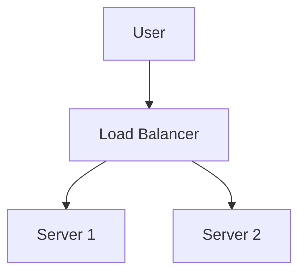

#  Markdown Viewer

**Markdown to perfect Word in one click — Mermaid, Vega, drawio, Canvas, Infographic, Graphviz, LaTeX (editable), code highlighting, local processing**

*Completely Free · 29 Professional Themes · 28 Languages Support*

 🚀 **Install Now (Choose Your Platform):**

- **Chrome / Chromium:** https://chromewebstore.google.com/detail/markdown-viewer/jekhhoflgcfoikceikgeenibinpojaoi
- **Firefox:** https://addons.mozilla.org/firefox/addon/markdown-viewer-extension/
- **VS Code:** https://marketplace.visualstudio.com/items?itemName=xicilion.markdown-viewer-extension · [Open VSX](https://open-vsx.org/extension/xicilion/markdown-viewer-extension)
- **Mobile (iOS/Android):** See [Mobile App](docs/platforms/mobile.md)

---

You love writing in Markdown — clean, efficient, version control friendly.  
But eventually, you always need a Word document.

**The old nightmare:**

😫 Manual screenshot flowcharts · Copy-paste formulas become messy · Format code by hand · Adjust tables cell by cell · Spend another 30 minutes tweaking fonts, spacing, and colors after export

**One document: 1 hour writing, 2 hours formatting.**

---

**Now it takes just 1 second.**

Click to download and get a perfect Word document:
- ✅ Mermaid diagrams → High-resolution images
- ✅ Vega/Vega-Lite data charts → High-resolution images
- ✅ drawio diagrams → High-resolution images
- ✅ Canvas diagrams → High-resolution images
- ✅ Infographic charts → High-resolution images
- ✅ Graphviz DOT graphs → High-resolution images
- ✅ LaTeX formulas → Word editable equations
- ✅ Auto syntax highlighting (100+ languages)
- ✅ 29 professional themes with one click
- ✅ Completely free, local processing

**Spend time on writing, not on formatting.**

---

## 🌍 Available Platforms

Markdown Viewer is not just a Chrome extension anymore — it's a unified rendering + export engine shipped across multiple platforms.

| Platform | Best for | Docs |
|---|---|---|
| **Chrome Extension** | Reading local/online Markdown in browser + export | [docs/platforms/chrome.md](docs/platforms/chrome.md) |
| **Firefox Extension** | Firefox users, same core features | [docs/platforms/firefox.md](docs/platforms/firefox.md) |
| **VS Code Extension** | Writing + live preview + export inside editor | [docs/platforms/vscode.md](docs/platforms/vscode.md) |
| **Mobile App** | Reading/export on the go (iOS/Android) | [docs/platforms/mobile.md](docs/platforms/mobile.md) |

See the full feature matrix: [docs/platforms/platform-comparison.md](docs/platforms/platform-comparison.md)

## 💫 See It in Action

### Technical Documentation: 15 Flowcharts, 2 Hours → 5 Minutes

**Before:** draw.io diagram → Export PNG → Insert into Word → Resize → Repeat 15 times = **2 hours**

**Now:** Write Mermaid code → Click download = **5 minutes**

## System Architecture

``````markdown

``````

Need changes? Modify code and re-export. **Save 115 minutes.**

### Academic Paper: 50+ Formulas, 3 Hours → 10 Minutes

**Before:** Word equation editor one by one OR paid tool subscription = **3 hours + Paid subscription**

**Now:** Write LaTeX syntax directly → Click download = **10 minutes + Free**

Given mass $m$ and acceleration $a$, according to Newton's second law:

```markdown
$$
F = ma = m\frac{dv}{dt} = m\frac{d^2x}{dt^2}
$$
```

Export as native Word format, fully editable. **Not an image, but a real equation object.**

### Team Collaboration: Weekly Reports, 1 Hour → 1 Minute

**Before:** Copy content → Set format → Adjust lists → Add styling → Excel charts + screenshots = **1 hour weekly**

**Now:** Open file → Choose theme → Click download = **1 minute**

Choose "Business" theme, Vega-Lite data charts auto-convert to high-res images, professional look. **Save 59 minutes weekly.**

**Business use cases:**
- 📊 Sales trends (line charts)
- 📈 Market share comparison (bar charts)
- 🎯 KPI achievement (gauges)
- 📉 Cost analysis (stacked charts)

Let data speak, generate professional reports with one click.

---

## 🎯 Three Core Features

### 1. Automatic Diagram Conversion

**Mermaid** · **Vega/Vega-Lite** · **drawio** · **Canvas** · **Infographic** · **Graphviz DOT** · SVG images · Complex HTML tables

**Mermaid:** Flowcharts, sequence diagrams, class diagrams, state diagrams → Technical docs, architecture design  
**Vega/Vega-Lite:** Bar charts, line charts, scatter plots, heatmaps → Business reports, data analytics  
**drawio:** Architecture diagrams, network topologies, UML diagrams → System design, technical documentation  
**Canvas:** Mind maps, knowledge graphs, concept maps → Brainstorming, planning boards  
**Infographic:** Statistical charts, infographics, data visualization → Data presentation, visual storytelling  
**Graphviz DOT:** Directed/undirected graphs, network topology, state machines → Dependency analysis, complex graphs

**Time comparison:** Complex sequence diagram (10 objects)
- Traditional tools: Draw 30min + Modify 20min + Adjust 10min + Export 5min = **65 minutes**
- Markdown Viewer: Write code 5min + Modify 30sec + Export 1sec = **6 minutes**

**Business scenario:** Quarterly sales report (5 bar charts)
- Excel charting + screenshots: Select data 15min + Format 10min + Screenshot 5min = **30 minutes**
- Vega-Lite: JSON data 2min + One-click export = **3 minutes**

**Precise, professional, reusable.**

### 2. Perfect Formula Conversion

LaTeX → Word editable equations (not images!)

After export, you can:
- ✅ Continue editing in Word
- ✅ Adjust font size
- ✅ Modify symbols and variables
- ✅ Copy to other documents

**One formula, two approaches:**
- ❌ Word equation editor: Click...click...click...select symbols...adjust positions
- ✅ LaTeX: `\int_0^\infty e^{-x^2}dx` Done

### 3. 29 Professional Themes

Different scenarios, different styles, one-click switch:

- 📊 Business / Technical → Business reports, technical docs
- 📚 Academic / Palatino → Academic papers, book typesetting  
- 🇨🇳 Heiti / Mixed → Chinese documents
- 🎨 Typewriter / Handwritten → Creative content

**WYSIWYG:** Preview looks exactly like exported Word. No guessing, no trial.

**No more manual adjustments:** Font, size, line spacing, paragraph spacing, code background...

---

## ⚡ Lightning Fast Experience

### Smart Cache: First Time 5s, Second Time 1s

Document with 50 Mermaid diagrams:
- **First open:** Text displays instantly, diagrams render in background, all done within 5s
- **Second open:** Load from cache, instant display (<1s)
- **Text modified:** Still instant (diagrams from cache)
- **Diagram modified:** Only re-render changed diagrams

**10x faster than Word, 100x smaller files.**

### Reading Enhancement

- **Three layouts:** Normal (1000px) / Full screen / Narrow (530px, preview Word effect)
- **Flexible zoom:** 50%-400%, shortcuts `Ctrl/Cmd +` `-` `0`
- **Smart TOC:** Auto-extract headings, sidebar navigation, `Ctrl/Cmd + B` to toggle
- **Position memory:** Auto-save scroll position, continue reading next time
- **History:** Track recently opened documents

---

## 🚀 Quick Start - 3 Steps

### Step 1: Install (30 seconds)

Pick one platform and install:

- **Chrome / Chromium:** Chrome Web Store link above
- **Firefox:** Firefox Add-ons link above
- **VS Code:** Extensions panel → search "Markdown Viewer" (or `code --install-extension markdown-viewer`)
- **Mobile:** Open App Store / Google Play and search "Markdown Viewer"

### Step 2: Open a Markdown file (1 minute)

**Browser (Chrome / Firefox) — local files:**

1. Enable local file access in your browser extension settings
2. ✅ Now you can double-click to open local `.md` files

**VS Code:** Open any `.md` file → run the preview command (see [VS Code Extension](docs/platforms/vscode.md))

**Mobile:** Use file picker or open from cloud drive (details in [Mobile App](docs/platforms/mobile.md))

**Not needed if:**
- Only viewing online docs (GitHub, blogs, etc.)
- Using browser's "Open File" function

### Quick Start

**Open documents:** Local `.md` files / supported diagram files (`.mermaid` `.vega` `.vl` `.drawio` `.canvas` `.infographic` `.dot` `.gv`) depending on platform

**Export to Word:** Click download button or `Ctrl/Cmd + S` → See progress → Auto-save

**Switch themes:** Click toolbar → Choose theme → Apply instantly

**Adjust view:** `+`/`-` zoom · Layout switch · `Ctrl/Cmd + B` TOC

---

## 🎁 Complete Features

### Full Markdown Syntax Support

Headings · Paragraphs · Bold · Italic · Strikethrough · Lists · Task lists · Blockquotes · Code blocks (100+ languages highlighted) · Tables · Links · Images · Mermaid diagrams · Vega / Vega-Lite charts · drawio diagrams · Canvas diagrams · Infographic charts · Graphviz DOT graphs · LaTeX formulas · HTML · GFM extensions

### 29 Themes

**Classic:** Default · Academic · Business · Manuscript · Newspaper  
**Reading:** Palatino · Garamond · Typewriter · Elegant  
**Modern:** Technical · Swiss · Minimal  
**Creative:** Magazine · Century · Handwritten · Verdana  
**Chinese:** Heiti · Mixed · Water  
**Playful:** Rainbow · Starry · Candy · Dinosaur · Space · Garden  
**Nature:** Forest · Ocean · Coral · Sunset

### 28 Interface Languages

English · 简体中文 · 繁體中文 · Русский · 日本語 · हिन्दी · 한국어 · Deutsch · Português (Brasil) · Português (Portugal) · Nederlands · Українська · Tiếng Việt · Беларуская · Français · Italiano · Bahasa Indonesia · Español · ไทย · Svenska · Türkçe · Eesti · Bahasa Melayu · Polski · Suomi · Lietuvių · Norsk · Dansk

---

## 💎 Competitive Advantages

|  | Manual Screenshots | CLI Tools | Online Services | Desktop Editors | Markdown Viewer |
|---|:---:|:---:|:---:|:---:|:---:|
| **Ease of Use** | Tedious | Setup needed | Upload needed | Install needed | ✅ One-click |
| **Mermaid** | Manual screenshot | Plugin needed | ✅ Supported | ✅ Supported | ✅ Native support |
| **Math Formulas** | Images | Images | Images | Images | ✅ Editable |
| **Privacy** | ✅ Local | ✅ Local | ❌ Cloud upload | ✅ Local | ✅ Local |
| **Themes** | - | - | 3-5 | 5-10 | ✅ 29 |
| **Offline** | ✅ | ✅ | ❌ | ✅ | ✅ |
| **GitHub Direct View** | ❌ | ❌ | ❌ | ❌ | ✅ |
| **Price** | Free | Free | Paid plans | Paid plans | ✅ Free |

**Core advantage: Faster, cheaper, safer, more powerful.**

---

## ❓ FAQ

**Q: Can I edit the exported Word document?**  
A: Yes. Standard .docx format, math formulas are editable, not images.

**Q: Which diagrams are supported?**  
A: All Mermaid diagrams (flowchart, sequence, gantt, class, state, pie, ER, etc.), Vega / Vega-Lite data visualization charts, drawio architecture diagrams, Canvas mind maps, Infographic statistical charts, Graphviz DOT graphs + SVG auto-conversion.

**Q: Is there a file size limit?**  
A: No limit. Smart cache, documents with 100+ diagrams open instantly.

**Q: Does it require internet?**  
A: No. Completely local processing, works offline.

**Q: Will my documents be uploaded?**  
A: Never. All processing happens locally.

**Q: How to switch themes?**  
A: Click toolbar icon → Select theme → Apply instantly.

**Q: Can I customize themes?**  
A: Currently 29 preset themes, customization coming soon.

**Q: Will large documents lag?**  
A: No. Progressive loading + smart cache, text displays instantly, diagrams render in background (first 5s, second 1s).

**Q: Does cache take up much space?**  
A: Default max 1000 items, approximately 500 MB, adjustable or clearable in settings.

**Q: Which browsers are supported?**  
A: Chrome/Chromium-based browsers (Edge, Brave, Opera, etc.) and Firefox.

**Q: Which Word versions can open the exported file?**  
A: Word 2016+ fully supported, Word 2013 also works. Fully compatible with WPS Office.

**Q: Can I export to PDF?**  
A: Currently Word only, PDF planned. You can export to Word then save as PDF.

**Q: Which theme suits me?**  
A: Business reports → Business · Academic papers → Academic · Technical docs → Technical · Chinese docs → Heiti/Mixed

**Q: What's the difference between Vega and Mermaid?**  
A: **Mermaid** is for flowcharts, architecture diagrams, and other schematic diagrams; **Vega/Vega-Lite** is for data visualization like sales charts, financial reports, and other data-driven business charts. They complement each other for different scenarios.

**Q: How to create charts with Vega-Lite?**  
A: Use ````vega-lite` code block in Markdown with JSON format chart specification. See [Vega-Lite official examples](https://vega.github.io/vega-lite/examples/).

---

## 🔒 Privacy Commitment

- ✅ All processing done locally, never uploaded
- ✅ No tracking, no personal data collection
- ✅ Open source code, auditable and transparent
- ✅ Browser extensions use modern platform standards (Manifest V3)

**Your privacy is 100% protected.**

---

## 🆘 Get Help

📖 [Full Documentation](https://github.com/markdown-viewer/markdown-viewer-extension) · 🐛 [Report Issues](https://github.com/markdown-viewer/markdown-viewer-extension/issues) · 💡 [Feature Requests](https://github.com/markdown-viewer/markdown-viewer-extension/issues) · ⭐ [GitHub Star](https://github.com/markdown-viewer/markdown-viewer-extension)

---

## 🎉 Get Started Now

**Install in 30 seconds, start using immediately:**

1. Install on Chrome / Firefox / VS Code / Mobile (links above)
2. Open a Markdown file
3. Preview and click export (or use `Ctrl/Cmd + S` where supported)
4. ✅ Get a clean, ready-to-share Word document

**You'll get:** Markdown → Word one-click conversion · Mermaid/Vega/drawio/Canvas/Infographic/Graphviz auto-convert · LaTeX editable formulas · 100+ languages syntax highlighting · 29 themes · Smart cache · Completely free

**Perfect for:** Technical writers · Students/researchers · Product managers · Developers · Anyone using Markdown

---

## 🌱 Community Projects

- 🖥️ [md2x](https://github.com/LarchLiu/md2x) - Node.js CLI tool for batch conversion and automation

---

## 📜 Open Source License

This project is open source under GPL-3.0 license. Welcome to Star, report issues, suggest features, and contribute code.

**Project URL:** https://github.com/markdown-viewer/markdown-viewer-extension

---

**Stop wasting time on formatting**

**Focus on writing, let Markdown Viewer handle everything else**

🚀 **Install Now:** https://chromewebstore.google.com/detail/markdown-viewer/jekhhoflgcfoikceikgeenibinpojaoi

*Completely Free · Local Processing · Privacy Protected*
